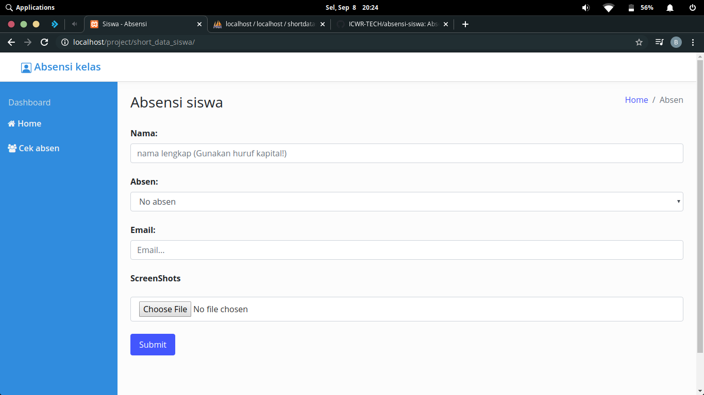
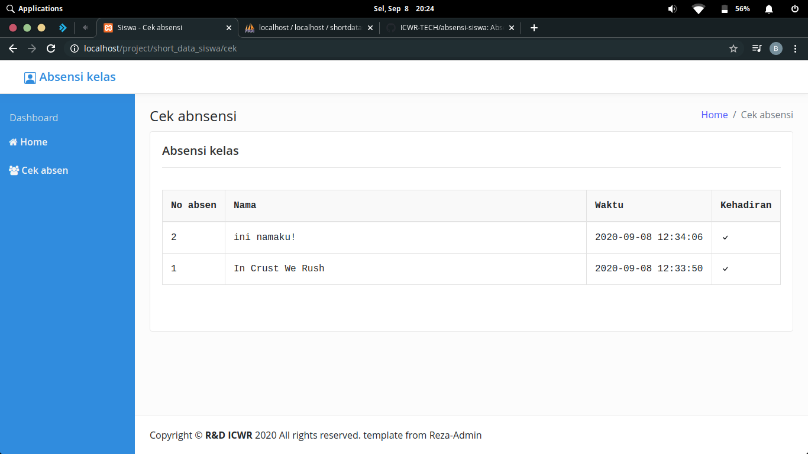
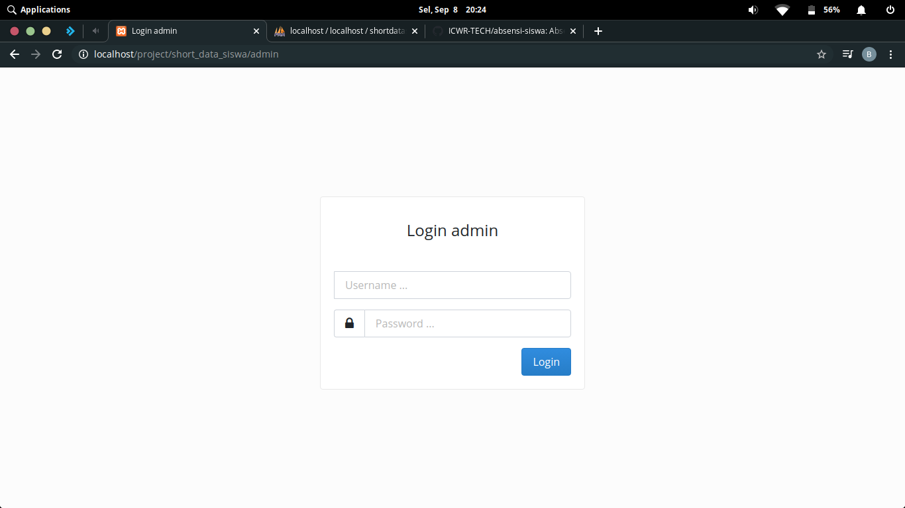
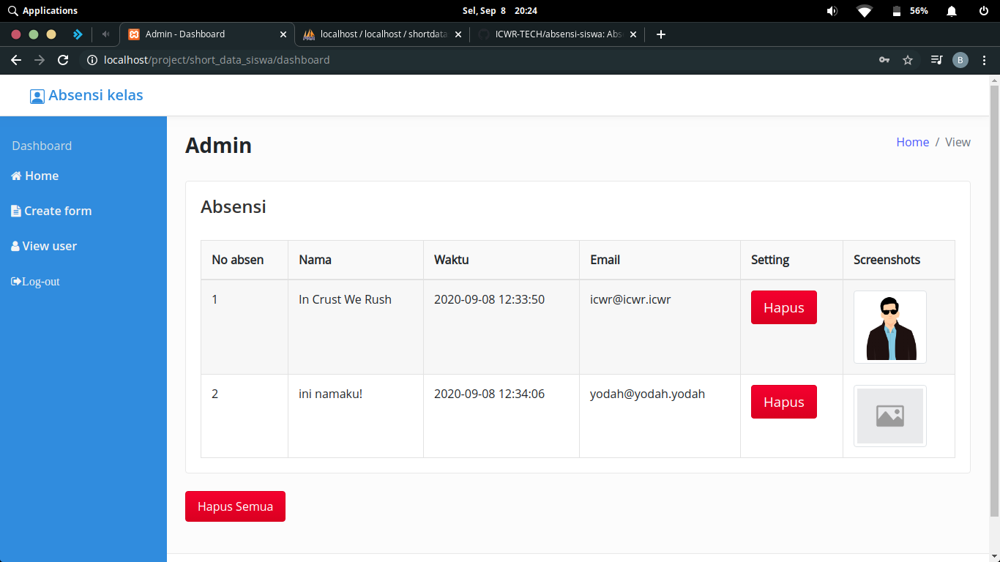
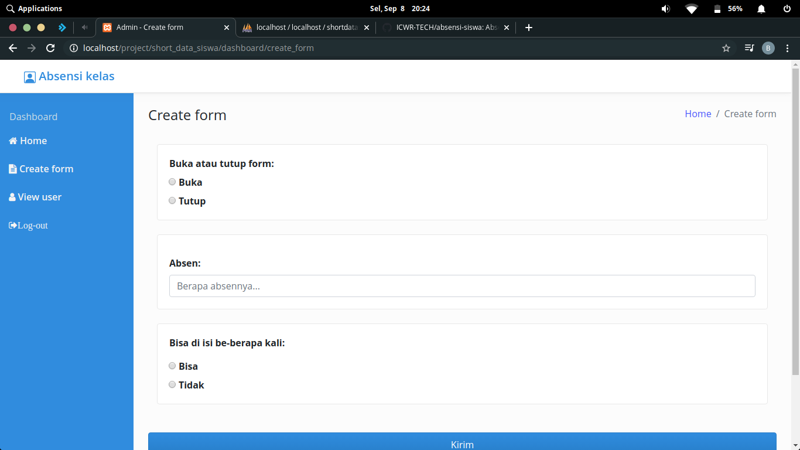

# absensi-siswa
Hai perkenalkan nama saya billy, saya membuat website ini dengan tujuan buat referensi temen2 semua. Terimakasih udah mengunjunginya:")

# Dibuat dari
```
1. PHP Native
2. Framework Codeigniter
3. Bootstrap
4. CSS
5. Jquery
6. JavaScript
7. HTML
```

# Fitur
```
- Murid
1. Tambah absen
2. Cek absen

- Admin
1. Cek absen
2. Buat formulir absen (Buka/tutup, Berapa absen, Perbolehkan isi berkalikali)
3. Lihat user,Create User, Delete User
4. Logout admin
```

# Template
Template dari Reza-admin [ <a href='https://github.com/rezafikkri/Reza-Admin' target="_blank">Link</a> ]

# Halaman admin
```
Halaman = [host]/admin
username=icwr
password=icwr
```

# Cara atur konfigurasi
```
1. Buat database dulu dengan nama shortdatasiswa (tutor cek google aja).
2. Import file yang bernama shortdatasiswa.sql ke phpmyadmin anda.
3. Setting username,password,host,namadb anda di file application > config > database.php sesuai konfigurasi anda.
Website siap digunakan!
```

# Lisensi


# Gambar


<br>

<br>

<br>

<br>

<br>


Thx:")

